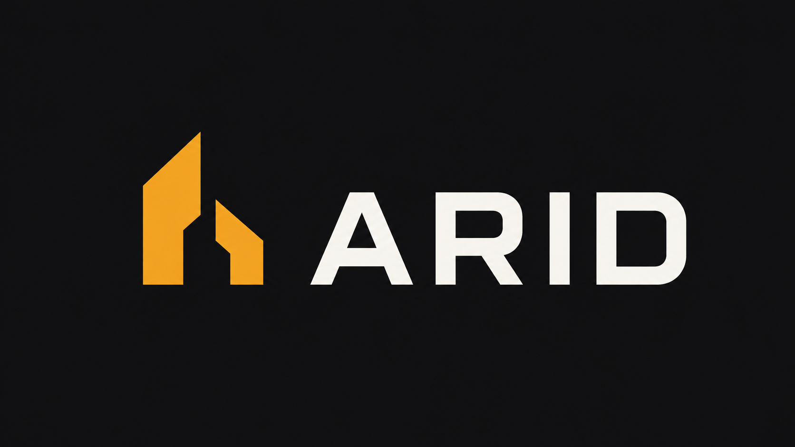

<p align="center">
  
</p>

<p align="center">
<!-- release-badge:start -->
  <a href="#project-status"></a>
<!-- release-badge:end -->
  <a href="#what-is-arid"></a>
  <a href="#what-is-arid"></a>
  <a href="#configuration"></a>
  <a href="#license"></a>
</p>

<h1 align="center">
   Arid
</h1>

<p align="center">
  <strong>Fast Python duplicate-code checker written in Rust. A focused replacement for Pylint <code>R0801</code> that complements Ruff.</strong>
</p>

<p align="center">
  <a href="#what-is-arid">What is Arid?</a> ·
  <a href="#project-status">Project status</a> ·
  <a href="#usage">Usage</a> ·
  <a href="#understanding-arids-output">Output</a> ·
  <a href="#machine-readable-contracts">Schemas</a> ·
  <a href="#configuration">Configuration</a> ·
  <a href="#github-action">GitHub Action</a> ·
  <a href="#pre-commit">Pre-commit</a> ·
  <a href="#migration-to-v2">Migration</a> ·
  <a href="#license">License</a>
</p>

---

## Project status

<!-- release-status:start -->
> [!IMPORTANT]
> **Arid is currently in beta.** The intended release feature set and core interfaces are frozen while prerelease validation and bug fixing continue toward stable release.
<!-- release-status:end -->

Arid is a **small, focused CLI** for one job:

> Detect duplicated Python source code quickly and accurately.

---

## What is Arid?

Arid is a Python-specific duplicate-code checker designed to replace the duplicate-code functionality of **Pylint `R0801` / `symilar`** without becoming another general-purpose linter.

Arid is intended to run alongside [Ruff](https://github.com/astral-sh/ruff), not compete with it.

```text
Ruff
├── linting
├── formatting
├── imports
├── modernization
└── general code quality

Arid
└── duplicate-code detection
```

> **Why Arid?** Because duplicated code isn't DRY.

### Why not just use Pylint?

Pylint's `R0801` checker provides useful Python-aware duplicate-code detection, but duplicate analysis can become very slow on larger codebases.

Arid preserves the useful shape of Pylint-style duplicate detection while using a Rust-native architecture built specifically for this job.

The goal is **not** bug-for-bug compatibility. Where Pylint relies on textual heuristics, Arid prefers correct Python syntax interpretation.

### Why not just use jscpd?

[jscpd](https://github.com/kucherenko/jscpd) is a capable multi-language copy/paste detector.

Arid occupies a narrower niche:

- Python only
- focused on Pylint-style duplicate-code semantics
- Python-aware normalization for comments, docstrings, imports, and signatures
- deterministic text, JSON, Markdown, and SARIF output
- baseline and CI workflows designed for Python projects
- intentionally minimal scope

Arid is not intended to replace jscpd for multi-language repositories.

---

## Goals

Arid v2 is designed to:

- detect duplicated Python source blocks across files
- detect non-overlapping duplicated blocks within the same file
- ignore comments, docstrings, imports, and function signatures when configured
- preserve accurate original source locations
- report concise `DUP001` diagnostics
- attach objective structural context and scope to findings
- provide deterministic duplication metrics
- support `[tool.arid]` configuration in `pyproject.toml`
- provide deterministic text, JSON, Markdown, and SARIF output
- support baseline-based incremental adoption and safe baseline maintenance
- audit source suppressions as active or stale maintenance state
- enforce stale suppression or baseline maintenance when requested
- explain targeted discovery decisions without running duplicate detection
- bypass ignore-file-derived traversal filters without bypassing Arid exclusion policy
- support focused reporting without narrowing whole-project detection
- support explicit project/configuration selection and introspection
- support one virtual Python source through standard input
- support incomplete-but-useful keep-going analysis without hiding failure
- produce multiple reports from one scan
- expose deterministic machine capabilities
- provide an official GitHub Action
- use bounded automatic parallel file preparation by default while preserving explicit serial execution
- publish versioned JSON Schemas for Arid-owned machine contracts
- show total elapsed time for completed normal text scans without adding volatile timing to machine formats
- publish artifacts for Linux x86_64 and ARM64, macOS x86_64 and ARM64, and Windows x86_64
- integrate with pre-commit while preserving whole-project detection
- run substantially faster than Pylint's duplicate-code checker

## Non-goals

Arid is intentionally **not** a general-purpose code-quality platform.

It does not aim to provide:

- formatting
- import sorting
- type checking
- dead-code detection
- complexity analysis
- security scanning
- semantic clone detection
- identifier-renaming clone detection
- structural similarity matching
- fuzzy AST similarity
- multi-language duplicate detection
- automated refactoring or duplicate removal
- severity levels
- a plugin framework
- persistent indexing or caching

If a feature belongs naturally in Ruff, it probably does not belong in Arid.

---

## Installation

### uv

Install Arid as an isolated CLI tool:

```bash
uv tool install arid
```

### pip

```bash
python -m pip install arid
```

Verify the installation:

```bash
arid --version
```

Published release artifacts support:

- Linux x86_64
- Linux ARM64 (`aarch64`)
- macOS x86_64
- macOS ARM64 (Apple silicon)
- Windows x86_64

Linux wheels and archives target `manylinux_2_17` / glibc 2.17 compatibility.

---

## Usage

A normal Python quality workflow can be as simple as:

```bash
ruff check .
arid .
```

Scan specific files or directories:

```bash
arid src tests
```

Require a larger duplicate before reporting it:

```bash
arid . --min-lines 8
```

### Normalization controls

Override normalization behavior for one scan:

```bash
arid . --no-ignore-docstrings
```

Configurable boolean options support positive and negative forms:

```text
--ignore-comments       --no-ignore-comments
--ignore-docstrings     --no-ignore-docstrings
--ignore-imports        --no-ignore-imports
--ignore-signatures     --no-ignore-signatures
--same-file             --no-same-file
--hidden                --no-hidden
```

This allows CLI arguments to override either value from `pyproject.toml`.

### Hidden, ignored, and excluded paths

Hidden files and directories are skipped by default during directory discovery. Include them with:

```bash
arid . --hidden
```

Directory discovery normally honors ignore-file-derived rules, including `.ignore`, `.gitignore`, parent Git ignore rules, global Git ignores, and `.git/info/exclude`.

To bypass only those ignore-file rules for one invocation:

```bash
arid . --no-ignore-files
```

`--no-ignore-files` does **not** disable Arid's own `exclude` policy and does not implicitly include hidden paths. Use `--hidden` separately when hidden discovery is intended.

Exclude matching paths with Arid policy:

```bash
arid . --exclude 'generated/**'
```

`--exclude` may be repeated:

```bash
arid . \
  --exclude 'generated/**' \
  --exclude 'vendor/**'
```

### Parallelism

Arid uses bounded automatic parallel file preparation by default:

```bash
arid .
```

Omitting `--workers` uses the same worker-selection policy as:

```bash
arid . --workers auto
```

Automatic selection uses available parallelism and is capped at four workers. If available parallelism cannot be determined, Arid falls back to one worker.

Require serial preparation explicitly with:

```bash
arid . --workers 1
```

Or request an exact positive worker count:

```bash
arid . --workers 2
arid . --workers 4
arid . --workers 8
```

Explicit numeric worker counts are not capped at four. The cap applies only to automatic selection.

Parallelism applies to file preparation—reading, parsing, and normalization. It does not change duplicate identity, finding order, fingerprints, metrics, baseline/focus behavior, machine contracts, or exit status.

Worker selection is intentionally CLI-only and cannot be configured in `[tool.arid]`.

### Output formats

Choose the primary output format:

```bash
arid . --format text
arid . --format json
arid . --format markdown
arid . --format sarif
```

`text` is the default. `--json` remains shorthand for `--format json`.

Normal text scans end with a high-signal aggregate view:

- **Summary** — files, source/analyzed lines, duplicate groups, occurrences, duplicate lines, and duplication percentage
- **Breakdown** — duplicate-group counts and shares by Context, Scope, and Distribution
- **Hotspots** — the top five files by duplicate-group participation, then occurrence count, then path

Hotspots are objective participation counts, not severity or quality scores.

For concise output without individual `DUP001` finding blocks:

```bash
arid . --summary-only
```

`--summary-only` changes presentation only. Detection, baseline filtering, focus filtering, suppression behavior, metrics, worker behavior, and exit status remain the same.

JSON summary mode emits the compact deterministic `summary-v1` contract:

```bash
arid . --summary-only --json
arid . --summary-only --format json
```

By contrast:

```bash
arid . --json
```

continues to emit the full `report-v4` document.

`--summary-only` supports text and JSON primary output. Markdown and SARIF primary output are rejected because those formats remain full finding-oriented reports.

Supplemental `--report` files remain full existing report formats even when the primary output is summary-only.

Completed normal text scans end with a human-facing elapsed-time footer such as:

```text
Total time: 18.7 ms
```

The footer is intentionally absent from JSON, Markdown, SARIF, supplemental report files, administrative machine contracts, incomplete exit-2 scans, and `summary-v1`.

Include original source snippets:

```bash
arid . --show-source
```

Control text color:

```bash
arid . --color auto
arid . --color always
arid . --color never
```

Color is semantic presentation only. Arid does not infer severity or grade duplication percentages.

### Multiple reports from one scan

Write supplemental reports without rerunning detection:

```bash
arid . \
  --format text \
  --report json=artifacts/arid.json \
  --report markdown=artifacts/arid.md \
  --report sarif=artifacts/arid.sarif
```

`--report FORMAT=PATH` may be repeated for `text`, `json`, `markdown`, and `sarif` during normal scans.

`--suppression-status` and `--explain-path` may also write a supplemental report, but their administrative contract is JSON-only:

```bash
arid . --suppression-status --report json=artifacts/suppressions.json
arid . --explain-path src/example.py --report json=artifacts/path.json
```

All outputs for an invocation are rendered from the same in-memory logical model.

### Baselines

Create a baseline for accepted duplicate debt:

```bash
arid . --write-baseline arid-baseline.json
```

Enforce it explicitly:

```bash
arid . --baseline arid-baseline.json
```

Or configure it in `[tool.arid]` so normal scans enforce it automatically.

Summary metrics are derived after baseline filtering, so accepted baseline debt does not appear in Summary, Breakdown, Hotspots, or `summary-v1`.

Inspect baseline state:

```bash
arid . --baseline-status arid-baseline.json
```

Treat stale baseline acceptance as CI failure while preserving the status document:

```bash
arid . --baseline-status arid-baseline.json --fail-on-stale
```

Prune stale accepted debt safely:

```bash
arid . --prune-baseline arid-baseline.json
```

Pruning removes stale acceptance only. It does not accept new duplicate debt.

### Focused reporting

Report only duplicate groups touching one or more selected files/directories:

```bash
arid . --focus src/changed.py
arid . --focus src/package --focus tests/package
```

Focus changes **what is reported, not what is compared**.

Arid still performs whole-project detection, applies baseline enforcement, and only then filters findings by focus. Reported groups retain all occurrences, including occurrences outside the focused path. The same rule applies to `summary-v1`: occurrence counts, files-with-duplicates, and hotspots are derived from the complete retained finding rather than only the focused path.

### Explicit project and configuration control

Use one exact configuration file:

```bash
arid . --config workspace/pyproject.toml
```

Disable config discovery:

```bash
arid . --no-config
```

Set the project root explicitly:

```bash
arid . --project-root workspace
```

When no explicit selector is used, Arid preserves normal nearest-ancestor configuration discovery.

Contradictory root/config combinations fail instead of being guessed.

### Introspection and discovery explanation

Show the resolved project configuration:

```bash
arid . --show-config
```

List exactly which Python files normal discovery would select:

```bash
arid . --list-files
```

Explain why one existing file or directory is included or excluded under the same discovery policy:

```bash
arid . --explain-path src/example.py
arid . --explain-path generated/example.py --json
```

The explanation distinguishes stable reasons such as Arid excludes, ignore-file rules, hidden paths, unsupported source types, scan-root boundaries, explicit inputs, and symlink policy. It is targeted: Arid does not parse the Python source, run duplicate detection, or recursively enumerate the target's descendants merely to explain the decision.

Show deterministic build capabilities as JSON:

```bash
arid --capabilities
```

`--capabilities` does not require project/configuration discovery.

### Virtual Python source

Analyze one virtual Python source from standard input:

```bash
cat src/example.py | arid . --stdin-path src/example.py
```

If `src/example.py` already exists in the scan corpus, the virtual source replaces it for that scan. Otherwise the virtual source is added when allowed by the resolved project context.

Arid never writes virtual source to disk.

### Keep-going analysis

Arid normally fails fast on source-processing errors.

Use:

```bash
arid . --keep-going --json
```

to continue after independent file-local read, parse, or normalization failures.

The resulting report is explicitly incomplete:

- `complete` is `false`
- structured source errors appear in `errors`
- the process exits `2`
- incomplete scans cannot emit SARIF

With `--summary-only --json`, the partial result is still emitted as deterministic `summary-v1` with `complete: false` and structured `errors`. The process remains exit `2`, and no timing value is included.

### Findings-only exit policy

For CI workflows that want findings reported without failing the job:

```bash
arid . --no-fail-on-findings
```

This maps a **complete findings-only** exit `1` to `0`.

It never masks operational/incomplete exit `2`.

---

## Suppressing intentional duplication

Arid supports source-level suppression regions:

```python
# arid: disable

# intentionally accepted duplicate code

# arid: enable
```

Code inside a disabled region does not participate in duplicate detection.

Suppression regions also create matching boundaries, so Arid does not construct a duplicate that bridges across disabled source.

Suppression directives are idempotent state transitions. A repeated `# arid: disable` while already disabled and a repeated `# arid: enable` while already enabled are valid no-ops. A disabled region may also continue through EOF; a closing enable directive is not required.

Audit all effective suppression regions without changing normal detection behavior:

```bash
arid . --suppression-status
```

Each effective region is classified as:

- `active` — removing the suppression would expose otherwise-reportable duplicate code or allow a duplicate to cross the suppression boundary
- `stale` — the suppression is no longer needed under the current analysis settings

No-op directives do not create audit records.

Treat stale suppressions as CI failure while still emitting the audit result:

```bash
arid . --suppression-status --fail-on-stale
```

This supports a maintenance invariant of **zero new duplication + zero obsolete suppression**. Intentional duplication may remain suppressed, but obsolete suppression directives can be required to disappear instead of becoming permanent lint graffiti.

Use suppression for local duplication that a project intentionally accepts. For project-wide existing debt, prefer a baseline instead of scattering suppressions across many files.

---

## Understanding Arid's output

Arid separates two questions:

> **Detection answers: “Is this code duplicated?”**
> **Context helps answer: “What kind of code is duplicated?”**

Arid deliberately does **not** assign severity or decide whether duplication should be removed. Duplicate code can be intentional, framework-driven, harmless, or worth refactoring.

A detailed scan emits each `DUP001` diagnostic before the aggregate summary. The diagnostic portion looks like:

```text
DUP001 4 duplicated lines
Context: declarative
Scope: class
Occurrences: 2 across 2 files (cross-file)

  src/models/user.py:12-15
  src/models/account.py:20-23
```

After the findings, Arid renders the overall **Summary**, the fixed Context/Scope/Distribution **Breakdown**, and up to five objective **Hotspots**.

Use `--summary-only` when those aggregate sections are sufficient and individual finding blocks are not needed.

`Total time:` follows completed normal text output and is presentation-only. Its value is expected to vary between invocations and is not part of Arid's deterministic machine-output guarantees.

### Effective normalized lines

`DUP001 4 duplicated lines` means the matching region contains four **effective normalized lines** satisfying the configured threshold.

Depending on configuration, normalization can remove:

- comments
- structural docstrings
- imports
- function/method signatures

Blank lines do not count toward `min-lines`, and punctuation-only lines do not increase the effective-line count. A four-line duplicate can therefore span more than four physical source lines.

### Context

Possible structural contexts are:

| Context | Meaning |
| --- | --- |
| `declarative` | Declarations or definitions such as direct module/class assignments or definitions. |
| `executable` | Executable statements, control flow, or function-body logic. |
| `mixed` | More than one structural context participates. |

Context is descriptive, not severity.

### Scope

Possible structural scopes are:

| Scope | Meaning |
| --- | --- |
| `module` | Module-level code. |
| `class` | Code structurally associated with a class. |
| `function` | Code structurally associated with a function or method. |
| `mixed` | More than one structural scope participates. |

Scope describes where a duplicate exists, not whether it is a problem.

### Distribution

Distribution describes how occurrences are spread across files:

| Distribution | Meaning |
| --- | --- |
| `same-file` | All occurrences are in one file. |
| `cross-file` | Multiple files are involved, with one occurrence in each involved file. |
| `hybrid` | Multiple files are involved and at least one file contains multiple occurrences. |

`hybrid` replaces v1 report distribution `mixed`. Structural context and scope still use `mixed` when appropriate.

### Source locations

Locations such as:

```text
src/models/user.py:12-15
```

always refer to original physical Python source, not Arid's normalized representation.

Use `--show-source` to include the original source text with each location.

### Duplicate groups

A block appearing in three files is one finding with three occurrences, not three pairwise findings.

### Duplicate lines and duplication percentage

Arid measures **redundant effective lines**. One occurrence of each duplicate group is treated as canonical; only redundant copies contribute duplicate lines.

A 10-line block appearing twice contributes 10 duplicate lines. Appearing three times contributes 20 duplicate lines.

The duplication percentage is:

```text
duplicate effective lines
───────────────────────── × 100
 analyzed effective lines
```

This measures redundant analyzed code rather than every line participating in a duplicated region.

### Finding identity

Report-v4 findings include a stable fingerprint:

```text
arid-finding-v1:sha256:...
```

The fingerprint identifies normalized duplicate content independently of path, physical line number, occurrence order/multiplicity, structural metadata, output format, and worker mode.

---

## Machine-readable contracts

Arid publishes JSON Schema documents for its versioned machine contracts:

- [Report schema v4](schemas/report-v4.schema.json) — current full JSON report contract from `--format json` / `--json`
- [Summary schema v1](schemas/summary-v1.schema.json) — compact deterministic aggregate contract from `--summary-only --json`
- [Operational error schema v1](schemas/error-v1.schema.json) — fatal JSON-mode operational errors
- [Capabilities schema v1](schemas/capabilities-v1.schema.json) — `arid --capabilities`
- [Baseline schema v1](schemas/baseline-v1.schema.json) — files created by `--write-baseline`
- [Suppression status schema v1](schemas/suppression-status-v1.schema.json) — deterministic `--suppression-status --json` lifecycle audit
- [Path explanation schema v1](schemas/path-explanation-v1.schema.json) — deterministic `--explain-path PATH --json` discovery decision

The two v2.1 administrative contracts may also be written directly with `--report json=PATH`; the supplemental file is rendered from the same typed model and JSON renderer as stdout.

Elapsed scan timing is deliberately excluded from all versioned JSON contracts and other machine-oriented formats.

[Report schema v3](schemas/report-v3.schema.json) remains published unchanged as the historical v1 report contract.

SARIF output remains SARIF 2.1.0 and uses the official SARIF schema rather than an Arid-owned schema.

### Summary v1

`summary-v1` is the compact aggregate contract intended for CI, tools, and coding agents that do not need every finding location.

It includes:

```text
schema_version
tool_version
complete
analysis
errors
files
files_with_duplicates
source_lines
analyzed_lines
duplicate_groups
occurrences
duplicate_lines
duplication_percent
context
scope
distribution
hotspots
```

Context, Scope, and Distribution contain fixed integer group counts.

Hotspots contain at most five paths, ranked by:

1. groups descending
2. occurrences descending
3. path ascending

`summary-v1` is derived from the final reportable findings after baseline and focus policy.

Worker count, elapsed timing, color, and human-formatted number strings are intentionally absent so logically identical scans remain deterministic across execution environments.

### Report v4

The top-level report contract includes:

```text
schema_version
tool_version
complete
analysis
errors
files
source_lines
analyzed_lines
duplicate_groups
duplicate_lines
duplication_percent
findings
```

Each finding includes its versioned `fingerprint`.

For migration details and concrete v3→v4 examples, see the [v2 migration guide](docs/arid-v2-migration-guide.md).

### SARIF finding identity

Each SARIF result exposes the same Arid fingerprint through:

```text
partialFingerprints["aridFindingFingerprint/v1"]
```

---

## Configuration

Arid uses `[tool.arid]` in `pyproject.toml`:

```toml
[tool.arid]
min-lines = 4
ignore-comments = true
ignore-docstrings = true
ignore-imports = true
ignore-signatures = true
same-file = true
hidden = false
exclude = [
    "generated/**",
    "vendor/**",
]
```

Current configurable defaults are:

| Option | Default | Meaning |
| --- | --- | --- |
| `min-lines` | `4` | Minimum effective normalized lines required for a duplicate. |
| `ignore-comments` | `true` | Ignore Python comments during matching. |
| `ignore-docstrings` | `true` | Ignore structural Python docstrings. |
| `ignore-imports` | `true` | Ignore import statements. |
| `ignore-signatures` | `true` | Ignore function/method declaration signatures. |
| `same-file` | `true` | Detect non-overlapping duplicate regions within one file. |
| `hidden` | `false` | Include hidden files/directories during directory discovery. |
| `exclude` | `[]` | Path patterns excluded from discovery. |
| `baseline` | none | Optional baseline used to accept existing duplicate debt. |

Configuration precedence is:

```text
CLI arguments
    ↓
pyproject.toml
    ↓
built-in defaults
```

Example:

```toml
[tool.arid]
min-lines = 6
ignore-docstrings = true
same-file = true
hidden = false
baseline = "arid-baseline.json"
```

Override it for one scan:

```bash
arid . \
  --min-lines 10 \
  --no-ignore-docstrings \
  --no-same-file \
  --hidden
```

Supplying one or more CLI `--exclude` values overrides the configured exclude list for that scan.

Execution, presentation, and administrative controls such as `--workers`, output format/color, focus, keep-going, introspection, virtual stdin, multi-output, suppression/baseline status, stale-policy enforcement, discovery explanation, ignore-file override, and baseline maintenance are CLI-only unless explicitly listed in the configuration table above.

---

## GitHub Action

Arid v2 includes an official composite GitHub Action.

Stable example:

```yaml
- uses: sponge-b0b/arid@v2.1.0
  with:
    paths: .
```

Useful inputs include:

| Input | Meaning |
| --- | --- |
| `version` | Exact PyPI Arid version installed by the Action. |
| `paths` | Newline-separated files/directories to scan. |
| `focus` | Optional newline-separated focus paths. |
| `arguments` | Additional normal-scan Arid arguments. |
| `fail-on-findings` | Whether duplicate findings fail the Action. |
| `sarif` | Upload SARIF when the scan is complete. |
| `job-summary` | Append the Markdown report to the GitHub job summary. |

The Action exposes:

```text
tool-version
has-findings
duplicate-groups
duplicate-lines
duplication-percent
files
occurrences
files-with-duplicates
summary-json
complete
scan-exit-code
```

Example with focus and a non-failing findings policy:

```yaml
- uses: sponge-b0b/arid@v2.1.0
  id: arid
  with:
    paths: .
    focus: src/package
    fail-on-findings: "false"
    job-summary: "true"
```

The Action runs Arid once per invocation. It uses the same supplemental report-v4 JSON document to derive existing metrics, `occurrences`, `files-with-duplicates`, and `summary-json`; optional job-summary and SARIF output also come from that same scan.

SARIF upload requires the normal GitHub code-scanning permissions for the workflow and is skipped for incomplete scans.

---

## Pre-commit

Arid's official pre-commit hook performs a whole-project `arid .` scan rather than limiting duplicate detection to staged Python files.

Arid must already be installed and available as `arid` on `PATH`; the hook requires pre-commit 4.4.0 or newer.

Use the stable v2 release:

```yaml
repos:
  - repo: https://github.com/sponge-b0b/arid
    rev: v2.1.0
    hooks:
      - id: arid
```

The hook honors normal `[tool.arid]` configuration, including configured baselines.

See [Arid pre-commit integration](docs/pre-commit.md) for installation details and behavior.

---

## Detection model

Arid detects **exact duplicate source blocks after configurable Python-aware normalization**.

For example, with comments and function signatures ignored:

```python
def first():
    # explanation
    value = calculate_value()
    save_value(value)
```

and:

```python
def second():
    # different explanation
    value = calculate_value()
    save_value(value)
```

can be duplicates.

Arid does **not** normalize identifiers, so these remain different:

```python
value = calculate_value()
save_value(value)
```

```python
result = calculate_value()
save_value(result)
```

Structural context is reporting metadata attached to a duplicate after detection. It does not turn Arid into a structural clone detector.

Semantic clones, renamed-identifier clones, and fuzzy AST similarity remain outside Arid's scope.

---

## Architecture

The detector pipeline remains intentionally small:

```text
discover
   ↓
source input
   ↓
parse + normalize
   ↓
intern lines
   ↓
suffix array
   ↓
LCP
   ↓
maximal repeats
   ↓
baseline
   ↓
focus
   ↓
report
```

Arid analyzes Python source entirely in Rust and never imports or executes the project being scanned.

V2 workflow controls reuse this same detector path; focus, baselines, multiple outputs, the GitHub Action, and virtual input do not create alternate duplicate detectors. Suppression audit and targeted path explanation are explicit administrative paths and do not replace or alter normal duplicate detection.

---

## Exit codes

Arid uses predictable exit codes:

| Exit code | Meaning |
| --- | --- |
| `0` | Successful complete scan or administrative result with no enforced policy failure. |
| `1` | Complete scan findings or an enforced stale-maintenance policy failure. |
| `2` | Invocation/configuration/operational failure or incomplete scan. |

`--no-fail-on-findings` can map a complete findings-only `1` to `0`, but never masks `2`. `--fail-on-stale` can make stale `--suppression-status` or `--baseline-status` state exit `1`; without that flag, stale maintenance state remains informational.

---

## Migration to v2

If you only run Arid as a normal CLI and do not consume machine output or Rust internals, you may require no migration work.

The intentional v2 breaking surfaces are concentrated in:

- report schema v3 → v4
- report `version` → `schema_version`
- new required report metadata
- required stable finding fingerprint
- occurrence distribution `mixed` → `hybrid`
- SARIF Arid finding identity
- narrowed supported Rust API

Baseline schema v1 and existing baseline files remain compatible.

See [Migrating to Arid v2](docs/arid-v2-migration-guide.md) for concrete before/after JSON examples and the complete checklist.

---

## Performance

The reproducible v2 benchmark campaign compares Arid against Arid 1.2.0 and current stable Pylint 4.0.6 on pinned corpora.

Serial v2 measured:

```text
Requests:  191.19x faster than Pylint
Pydantic:  219.06x faster than Pylint
Polaris:   249.68x faster than Pylint
```

The qualifying medium and large corpora remain far above Arid's 10x performance floor.

A paired reversed-order v1.2→v2 investigation found only low-single-digit serial overhead across the canonical corpora, with no unacceptable performance regression.

See [Arid v2 performance report](docs/arid-v2-performance-report.md) for the exact methodology and results.

---

## Development

Arid includes dedicated tooling and documentation for release qualification, performance benchmarking, real-world validation, and v2 maintenance:

- [V2 migration guide](docs/arid-v2-migration-guide.md)
- [V2 performance report](docs/arid-v2-performance-report.md)
- [Release qualification](qualification/README.md)
- [Benchmarks](benchmarks/README.md)
- [Validation](validation/README.md)
- [V2 release roadmap](docs/arid-v2-release-roadmap.md)
- [V2.1 release roadmap](docs/arid-v2.1-release-roadmap.md)

The targeted v2.1 integration suite is `validation/v2.1.sh`; it runs the inherited v2 suite first and then validates the v2.1 maintenance, discovery, machine-contract, and timing behavior.

---

## License

Licensed under either of:

- Apache License, Version 2.0
- MIT License

at your option.

---

## Contributing

Contributions should preserve Arid's focused scope and product contract. Bug fixes, compatibility improvements, tests, documentation, and evidence-driven performance work are welcome; scope-expanding features should be discussed before implementation.
